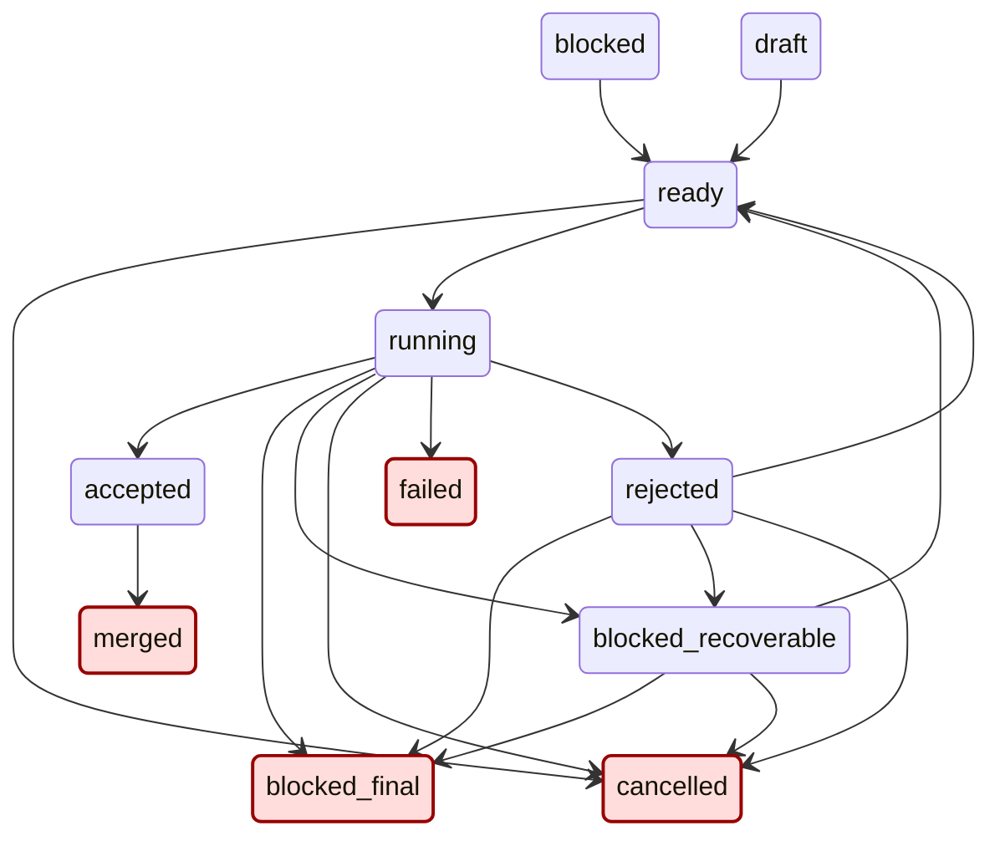

```mermaid
stateDiagram-v2
    accepted --> merged
    blocked --> ready
    blocked_recoverable --> blocked_final
    blocked_recoverable --> cancelled
    blocked_recoverable --> ready
    draft --> ready
    ready --> cancelled
    ready --> running
    rejected --> blocked_final
    rejected --> blocked_recoverable
    rejected --> cancelled
    rejected --> ready
    running --> accepted
    running --> blocked_final
    running --> blocked_recoverable
    running --> cancelled
    running --> failed
    running --> rejected

    classDef terminal fill:#fdd,stroke:#900,stroke-width:2px
    class blocked_final terminal
    class cancelled terminal
    class failed terminal
    class merged terminal
```
